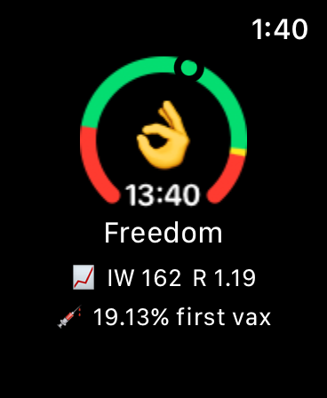

# LockdownWatch
> Lockdown reminder for WatchOS.

## About

LockdownWatch supports the following features:

- Configurable curfew watch and reminder
- Regional SARS-CoV-2 statistics

Supported countries: `[ USA, Germany ]`

## Data Sources

| Data Source       | Link                                                | Countries   |
| ----------------- | --------------------------------------------------- | ----------- |
| JHU CSSE GIS Data | [Link](https://github.com/CSSEGISandData/COVID-19)  | Global      |
| RKI API v2        | [Link](https://api.corona-zahlen.org)               | Germany     |

## Screenshots

